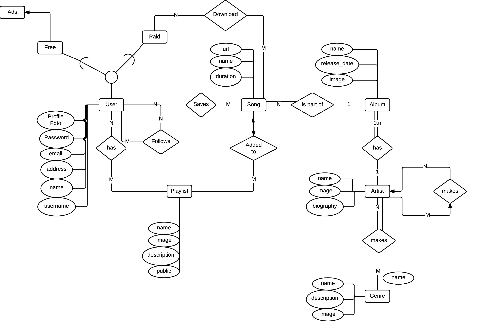

# Musify diagrams
## Version 1
### Entity-Relationship Diagram

#### Uitleg
Ik begin de uitleg van de Musify ERD bij de `user`. Dit omdat dit een gemakkelijk start punt is, en alle andere onderdelen op de een of andere manier zijn verbonden aan de `User`. 
 
De `User` entiteit heeft een aantal standaard attributen, denk hierbij aan de naam, email en straatnaam. 
 
Daarnaast heeft het ook gegevens die nodig zodat je je kan identificeren, denk hierbij aan de gebruikersnaam en wachtwoord, en als laatste is hoe je jezelf presenteerd naar andere doormiddel van een profielfoto.
 
De `User` kan een `Free` `User` of een `Paid` `User` zijn. De `Free` `User` krijgt advertenties te zien voordat er een nummer word afgespeeld. De `Paid` `User` krijgt geen advertenties te zijn, maar kan daarnaast ook nog een `Songs` downloaden om offline te beluisteren.
Het systeem controleerd dan ook of de `User` betaald heeft of niet, en indien hij betaald heeft, wanneer de laatste keer is dat hij heeft betaald.
 
Een `Paid` `User` kan zoveel `Songs` downloaden als de `User` wilt.
 
Een `User` kan ook een `Song` opslaan, hierbij hoeft er niet gekeken of het een `Free` of `Paid` user is, aangezien beide groepen dit kunnen doen. 
Als ze een `Song` goed vinden, dan kunnen ze deze aan de `User` koppelen, zodat de `User` de `Song` later gemakkelijk kan terug vinden.
 
De `Song` entiteit heeft ook een aantal standaard attributen, denk hierbij aan de naam van de `Song`, de `duration`, en de `url` dat gezocht moet worden als een `User` de `Song` wilt afspelen.
 
De `User` kan ook een `Playlist` aanmaken of beluisteren hierbij kan de `User` een `Song` toevoegen aan de `Playlist`. De `User` die de `Playlist` beluisterd zal de `Song` die is toegevoegt dan ook kunnen beluisteren.
Hierbij moet de `Playlist` natuurlijk wel op `Public` staan. De `Playlist` entiteit heeft de attributen `name`, `description`, `image`, en `public`. Waarbij `Public` op true of false kan staan, en dus betekend dat een andere `User` de `Playlist` wel of niet kan beluisteren en zien.
Ook kan een `User` een andere `User` volgen. Zo krijgt de `User` die een andere `User` volgt, notificaties als de gevolgde `User` een nieuwe `Song` of `Playlist` opslaat.
 
Als we ons wat meer distantieren van de `User`, dan komen we uit bij een `Album`. Elke `Song` is onderdeel van een `Album`. Een `Song` is maar onderdeel van 1 `Album` en een `Album` kan meerdere `Songs` hebben.
De `Album` entiteit bevat de volgende attributen: `name`, `release_date` en `image`. Waarbij `name` de naam van het album is, de `release_date` de datum van uitgave is en `image` is de album art.
 
Een `Album` word gemaakt door een `Artist`, de `Artist` kan dan ook 0 of meer `Albums` hebben.
De `Artist` entiteit heeft de attributen `name`, `image`, en `biography`. de `name` geeft weer wie de `artist` is, de `afbeelding` geeft de `User` wat visualiteit, zodat de `User` weet hoe de `Artist` eruit ziet, en als laatste is er de `biography` waar het leven / de cariere van de `Artist` word weergegeven.
Een `Artist` maakt een bepaalde soort muziek, maar er zijn ook andere `Artists` die soortgelijke muziek maken, of onder hetzelfde rijtje vallen als de `Artist.
Deze Artists kunnen gekoppeld worden als een `similar` `artist`. Als een `User` een bepaalde `Song` van een `Artist` luisterd, dan zal eronder een rijtje met `similar` `artists` tevoorschijn komen, die de `User` ook andere `Songs` en `Artists` laat ervaren, die de `User` misschien niet kende.
Daarnaast maakt de `Artist` ook nog een bepaald `Genre`, denk hierbij aan pop, rock, electro, r&b, hip hop, country etc... Een `Artist` kan meerdere `Genres` hebben, en `Genres` kunnen gemaakt worden door meerdere `Artists`.
De `Genre` entiteit heeft de attributen `name`, `description` en `image` waarbij eigenlijk hetzelfde geld als bij de andere `entiteiten` die deze attributen hebben gehad.
De `name` staat voor de naam van het `Genre`, de `description` geeft korte uitleg wat het `Genre` inhoud, en de `image` geeft het `Genre` visueel weer.

### Database Design

### Database Design

